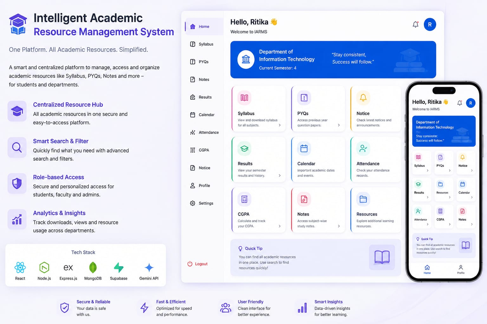

  

<h1 align="center">Intelligent Academic Resource Management System</h1>

  A smart academic resource platform for managing syllabus, PYQs, notices,
  results, attendance, notes and other student resources.

📌 About the Project

The Intelligent Academic Resource Management System (IARMS) is a centralized academic platform designed to make educational resources easier to access, organize, and manage.

The system provides students with a single platform to explore syllabus, Previous Year Questions (PYQs), notices, results, attendance, calendar, CGPA, notes, and study resources.

The platform also integrates OCR and AI-powered text extraction to process academic documents and make their content searchable and accessible.

---

✨ Key Features

- 📚 Syllabus Management — Access subject-wise and semester-wise syllabus.
- 📝 PYQ Repository — Browse and access Previous Year Question Papers.
- 📢 Notices — View important academic announcements and updates.
- 🎓 Results — Access examination results and academic records.
- 📅 Academic Calendar — Keep track of important academic dates and events.
- 🧑‍🎓 Attendance Tracking — View and manage attendance records.
- 🧮 CGPA Calculator — Calculate and track academic performance.
- 📖 Notes & Study Materials — Organize and access learning resources.
- 🔍 Smart Search — Quickly find relevant academic resources.
- 🤖 AI/OCR Integration — Extract text from document-based academic resources.
- 🔐 Role-Based Access — Provide appropriate access based on user roles.
- 📊 Resource Management — Organize resources according to departments, semesters, and subjects.

---

🏗️ System Architecture

                    ┌─────────────────────┐
                    │      Frontend       │
                    │   React Interface   │
                    └──────────┬──────────┘
                               │
                               ▼
                    ┌─────────────────────┐
                    │       Backend       │
                    │      FastAPI        │
                    └──────────┬──────────┘
                               │
              ┌────────────────┼────────────────┐
              │                │                │
              ▼                ▼                ▼
        ┌───────────┐    ┌───────────┐    ┌───────────┐
        │ Supabase │    │ Gemini API │    │ Cloudinary│
        │ Database │    │  AI / OCR  │    │   Storage │
        └───────────┘    └───────────┘    └───────────┘

---

🛠️ Tech Stack

Technology| Purpose
React.js| Frontend development
Python| Backend & processing
FastAPI| REST API development
Supabase| Database & backend services
Gemini API| AI-powered document processing
OCR| Text extraction from scanned documents
Cloudinary| Document/file storage
Git & GitHub| Version control

---

🤖 AI & OCR Integration

One of the key components of the system is its document-processing pipeline.

Academic PDFs and scanned documents can be processed using OCR and AI-based extraction to convert unstructured document content into usable text.

Academic PDF / Scanned Document
              ↓
        Document Upload
              ↓
          OCR Processing
              ↓
       AI-based Extraction
              ↓
        Structured Text
              ↓
      Searchable Resources

This makes large collections of academic documents easier to process, search, and manage.

---

📱 Application Modules

Student Module

- Dashboard
- Syllabus
- PYQs
- Notices
- Results
- Calendar
- Attendance
- CGPA
- Notes
- Study Resources

Resource Management

- Department-wise organization
- Semester-wise organization
- Subject-wise resources
- Document management
- Search and filtering

AI Processing

- Document upload
- OCR-based text extraction
- AI-assisted processing
- Searchable academic content

---

🎯 Project Goals

The primary goal of IARMS is to reduce the difficulty students face while searching for academic resources scattered across different platforms.

The system aims to provide:

One Platform → One Search → All Academic Resources

---

🚀 Future Improvements

- 🔔 Real-time notifications
- 📱 Dedicated mobile application
- 🤖 AI-powered academic assistant
- 🔎 Advanced semantic search
- 📈 Personalized learning analytics
- ☁️ Improved document processing pipeline
- 👥 Faculty and administrator dashboards
- 📊 Advanced resource usage analytics

---

📸 Project Preview

«Screenshots and an animated demonstration of the application will be added here.»

---

👩‍💻 Developed By

Ritika Gujar

B.Tech — Information Technology

Areas of Interest: Cybersecurity • AI/ML • Web Application Security • Backend Development

---

⭐ Project Highlights

- Centralized academic resource management
- AI/OCR-powered document processing
- Structured department → semester → subject organization
- REST API-based backend
- Cloud-based database and storage
- Modern responsive user interface

---

📄 License

This project is developed for educational and project-development purposes.

